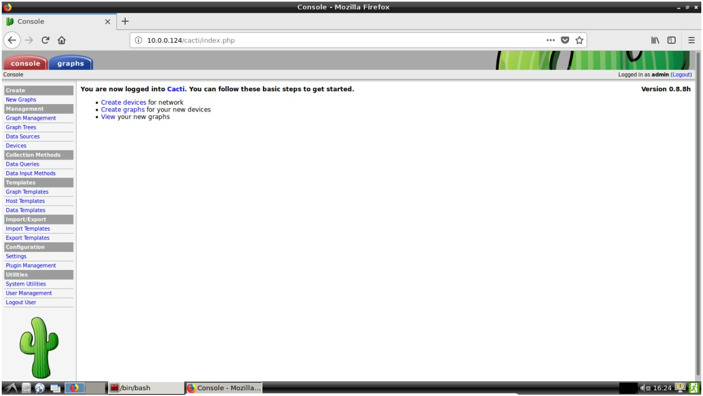
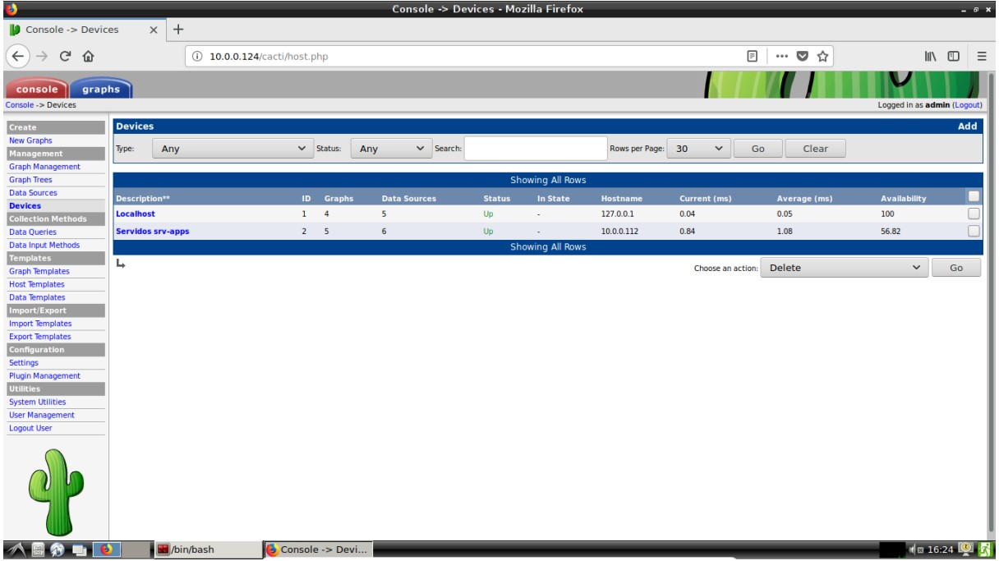
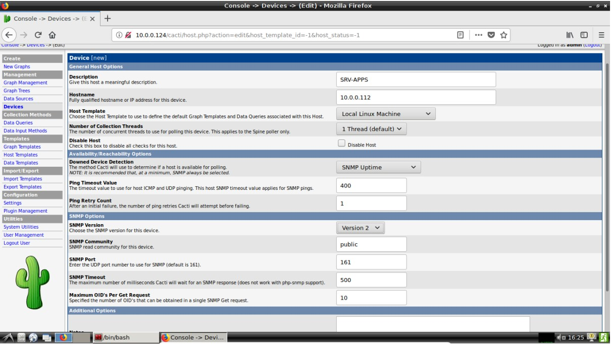
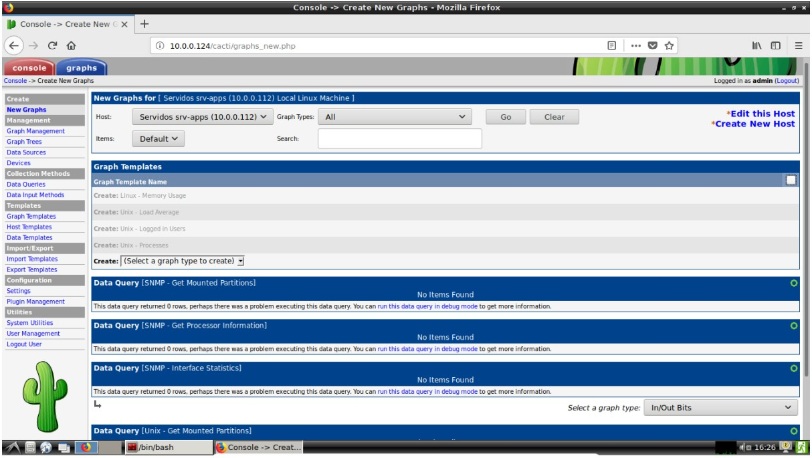
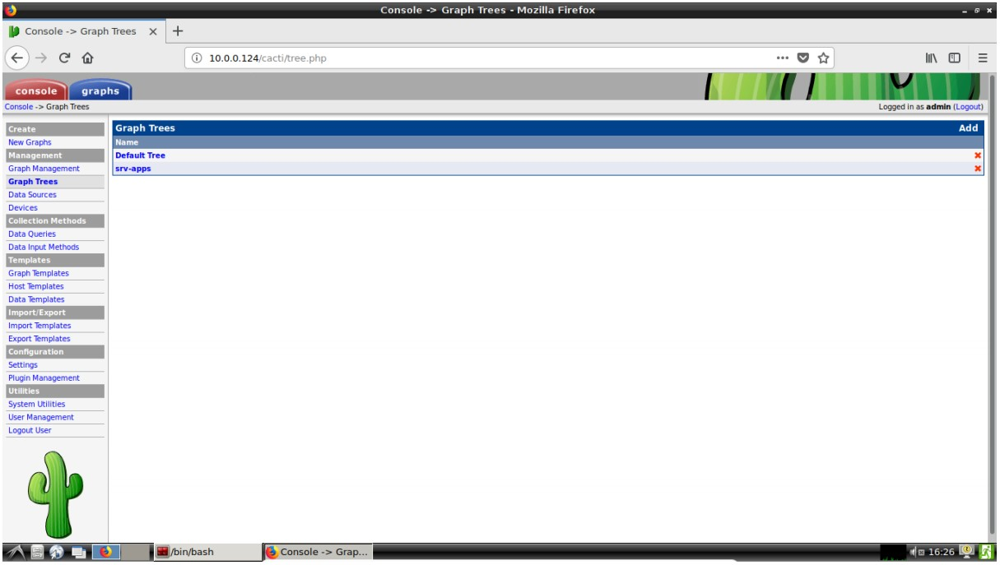
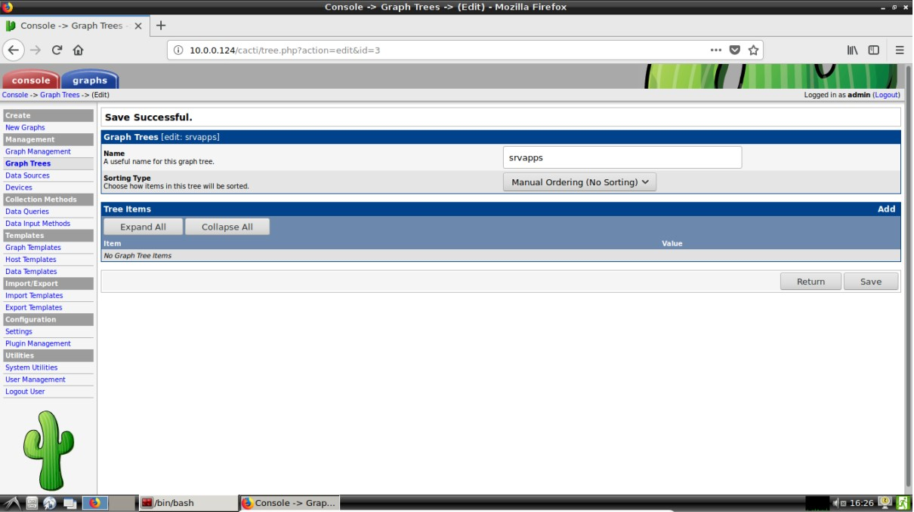
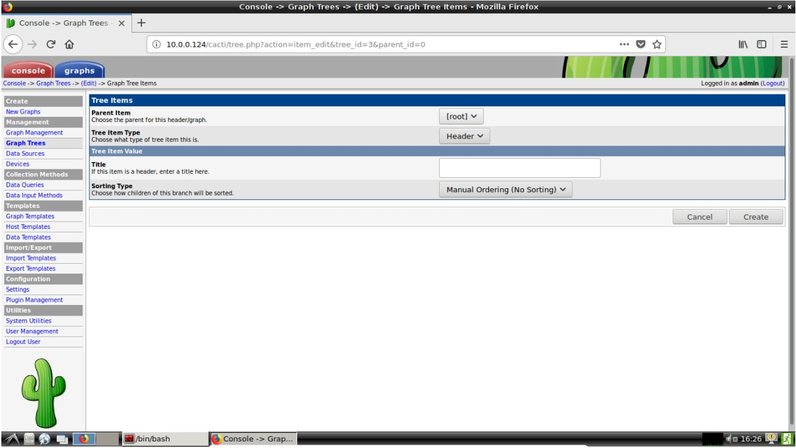
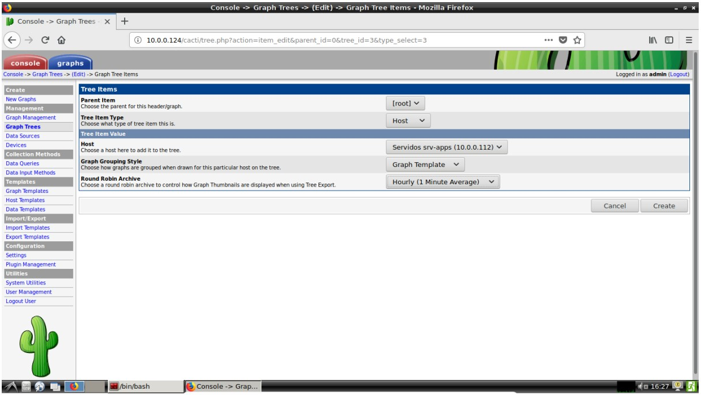
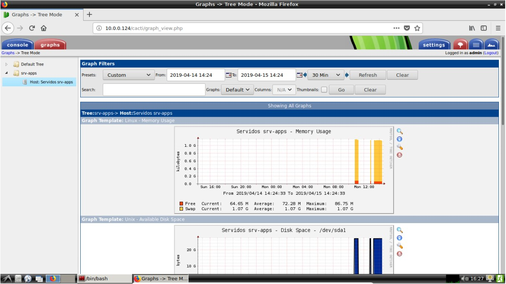

# ___Atividade 05_1___ #

## ___Sumário___ ##
- [___Atividade 05_1___](#atividade-051)
	- [___Sumário___](#sum%C3%A1rio)
	- [__srv-apps__ - Servidor que será monitorado](#srv-apps---servidor-que-ser%C3%A1-monitorado)
	- [__monitor-unitins__ - Servidor contendo programa de monitoramento Cacti.](#monitor-unitins---servidor-contendo-programa-de-monitoramento-cacti)
		- [Configurando host no Cacti](#configurando-host-no-cacti)
		- [Configurando os gráficos](#configurando-os-gr%C3%A1ficos)

## __srv-apps__ - Servidor que será monitorado ##
Para monitorar este host, é necessário instalar o SNMP (protocolo de monitoramento) que permitirá ao Cacti capturar os dados desta máquina

1. Instalar o snmp
   ```bash 
   $apt install snmp snmpd
   ```

Após instalar é necessário configurar o serviço snmpd para permitir a captura de dados remotamente via UDP. Para isso é necessário editar o arquivo `/etc/snmp/snmpd.conf`

2. Configurar o snmpd
   ```bash
	$vim /etc/snmp/snmpd.conf
	$systemctl restart nmpd
	```
	> neste arquivo sera necessario comentar a linha 15, `agentAddress udp:127.0.0.1:161` e descomentar a linha 17, `agentAddress udp:161, udp6:[::1]:161`.

	> É necessário adicionar a linha referente ao método de acesso remoto entre a linha 50 e 60, esta linha deverá seguir esta estrutura `rocommunity public <endereço IP de rede com mask>`.


3. Para verificar se o serviço está funcionando pode-se verificar o status do serviço e verificar se a socket udp (161) está aberto.

	```bash
	$systemctl status snmpd
	$netstat -nlup
	```
__________________________________________________________________
## __monitor-unitins__ - Servidor contendo programa de monitoramento Cacti. ##

### Configurando host no Cacti
Primeiramente é necessário adicionar o host que será monitorado.
Na tela inicial já é apresentado o botão **Create devices**, clicando nele, o usuário será direcionado à página referente aos hosts.



Nesta página existe um botão **Add** localizado na extremidade direita da barra azul que vai redirecionar o usuário à página para adicionar um novo host.



Nesta tela basta preencher os dados do servidor **srv-apps**



### Configurando os gráficos

Indo para a página **New Graphs**, localizada no menu lateral esquerdo, é possível configurar quais gráficos serão gerados a partir do dados capturados do host remoto.

Neste campo deve-se marcar todas as caixas no **Graph Templates** e clique em confirmar na parte mais baixa da página. Após isso o usuário deve se direcionar à página **Graph Trees**.



Nesta página deve-se clicar no botão **Add** na extremidade direita da barra azul, acessando a página referente à configuração de uma nova arvore de gráficos.



Aqui deve-se preencher apenas o campo **Name** e depois clicar em **Save**, após isso, na próxima página, o usuário deverá preecher os campos da mesma forma que as imagens abaixo e depois clicar em "Create".



Após isso basta acessar a aba **graphs** na parte superior esquerda da página para visualizar os gráficos gerados.





